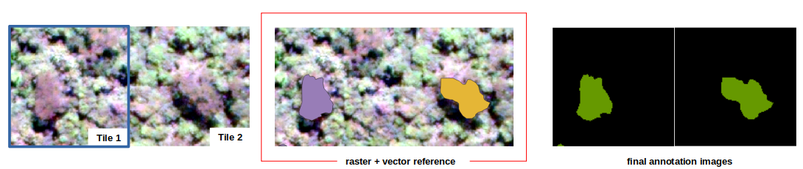

<p align="center">    
    <a href="https://github.com/Bioverse-Labs/image-processing/stargazers" alt="Stars">
        </a>
    <a href="https://github.com/Bioverse-Labs/image-processing/stargazers" alt="Stars">
        </a>
    <a href="https://github.com/Bioverse-Labs/image-processing/forks" alt="Forks">
        </a>
    <a href="https://github.com/Bioverse-Labs/image-processing/LICENCE.md" alt="Licence">
        </a>
    <a href='https://bioverse-ip.readthedocs.io/en/latest/?badge=latest'>
    </a>
    <a href="https://twitter.com/BioverseLabs" alt="Twitter">
        </a>
</p>

# Bioverse Labs (image-processing module)
The image-processing module incorporate essential procedures to prepare remote sensing images mostly for automatic classification methods, in this case specifically, deep-learning approaches. 

Beyond the routines, three main methods have been developed: image tiling, vector tiling, annotation images preparation, among other independent preprocessing procedures (available in `/scripts` - in `bash`).

**All modules available here are under construction. Therefore, many errors and malfunctions can occur.**

1. [Setting up your environment](#1-Setting-up-your-environment)
2. [Prepare your virtual environment](#2-Prepare-your-virtual-environment)
3. [Examples ](#3-Examples)
4. [TODO-list](#4-TODO-list)

# Setting up your Python environment
This command-line solution was mainly use for image processing analysis, for specific applications and specific purposes. Most of the methods and libraries to solve these particular events might have alternatives 

## Python version and OS
The `image-processing` was developed using Python version 3.7+, and **Linux 19.10 eoan** operational system. 

# Prepare your virtual environment
First of all, check if you have installed the libraries needed:
```
sudo apt-get install python3-env
```
then, in the
```
python -m venv .venv
```
and activates it:
```
source .venv/bin/activate
```
as soon you have it done, you are ready to install the requirements.

## Installing `requirements.txt`
If everything is correct, and you **virtualenv** is activated, execute:
```
pip install -r requirements.txt
```

## The `settings.py` file:
This file centralized all constants variable used in the code. Until now, only the constants below were required. The shapefiles usually has with it a attribute table, where the geographic geometry and metadata are stored:


This shapefile should have at least one column for the class name. The class name to be read is indicated by `CLASS_NAME` variable. This shapefile could also have multiple classes, for each one, a color should be specified. The values specified in `CLASSES` gives either the exact name of the class as its respective RGB color.  
```
VALID_RASTER_EXTENSION = (".tif", ".tiff", ".TIF", ".TIFF")
VALID_VECTOR_EXTENSION = ".shp"

CLASS_NAME = 'class' # <---- column name in attribut table
CLASSES = {
    "nut": [102, 153, 0],
    "palm": [153, 255, 153]
}
```
annotation image after processing (with RGB color (102,153,0) for `nut` class):


# Examples 
## Running the raster tilling:
The raster tiling consists in crop the full image in small peaces in order to get a required dimension for most of the supervised classifiers. 

Here, the procedure demands 6 arguments, which are the procedure to be executed (`-procedure`), the full image path (TIFF format - `-image`), the output to the tiles (`-output`), the width dimension of the tiles (`-tile_width`), the height dimension of the tiles (`-tile_height`), and a boolean verbose outcomes (`-verbose`). Besides, it is really important to configure the composition of the tiles. In `settings.py` look for `RASTER_TILES_COMPOSITION` and define the ordered band that the tiles should be saved. Right after, the procedure is ready to run:
```
python main.py -procedure tiling_raster 
               -image PATH_TO_FULL_IMAGE_IN_TIFF_FORMAT  
               -output PATH_TO_OUTPUT_RASTER_TILES
               -tile_width DIMESION_OF_TILES 
               -tile_height DIMESION_OF_TILES 
               -verbose BOOLEAN
```
 Considering `-image` with `/PATH/sample-raster.tif`, `-tile_width` and `-tile_height` set as `256`, and verbose True, then, you should see the following logs:
```
[2021-02-07 15:05:04] {tiling.py      :265 } INFO : >>>> File /PATH/sample-raster.tif opened! Image with [1560, 1083] size and Byte type! 
[2021-02-07 15:05:04] {tiling.py      :266 } INFO : >>>> Tiling image /PATH/sample-raster.tif. 1560 x 1083 pixels. Estimated 26 tiles of 256 x 256... 
```

The results of tiling the image will end up with the following outcomes: 


the tiles in between were hidden only for visualization purposes. 

> In Linux, it should be run in main folder

## Running the vector tilling:
The vector tiling consists in crop the full shapefile in small peaces according to the raster tiles extends processed before. The procedure saves a tiled shapefile if the full shapefile intersect a raster tile. If it does not intersect, the raster tile is then deleted (in order to save space). 

Here, the procedure demands 6 arguments, which are the procedure to be executed (`-procedure`), the full shapefile path (SHP format - `-image_tiles`), the output to the tiles (`-output`), the shapefile reference (`-shapefile_reference`), and a boolean verbose outcomes (`-verbose`). 
```
python main.py -procedure tiling_vector
               -image_tiles PATH_TO_OUTPUT_RASTER_TILES  
               -output PATH_TO_OUTPUT_VECTOR_TILES
               -shapefile_reference PATH_TO_REFERENCE_SHAPEFILES               
               -verbose BOOLEAN
```
 Considering `-image_tiles` with the path of the raster tiles previously executed (i.e. `-output`), the respecting reference as `/PATH/as `256`, and verbose True, then, you should see the following logs:
```
>> Tiling vector /PATH/sample-raster.shp respecting to the tiles extends
```

The results of tiling the vector reference will end up with the following outcomes: 


> In Linux, it should be run in main folder

## Running the SHP to PNG conversion:
The vector tiling consists in crop the full shapefile in small peaces according to the raster tiles extends processed before. The procedure saves a tiled shapefile if the full shapefile intersect a raster tile. If it does not intersect, the raster tile is then deleted (in order to save space). 

Here, the procedure demands 6 arguments, which are the procedure to be executed (`-procedure`), the shapefile tiles path (`-shapefile_folder`), the output to the final annotation images (`-output`), the width dimension of the tiles (`-tile_width`), the height dimension of the tiles (`-tile_height`), and a boolean verbose outcomes (`-verbose`). 
```
python main.py -procedure shp2png
               -shapefile_folder PATH_TO_VECTOR_TILES
               -output PATH_TO_SAVE_ANNOTATION_IMAGES
               -tile_width DIMESION_OF_TILES 
               -tile_height DIMESION_OF_TILES 
               -verbose BOOLEAN
```

The results of tiling the vector reference will end up with the following outcomes: 


Note that when the polygon do not intersect any raster image, none label images are generated.  

> In Linux, it should be run in main folder

## Split the training and validation datasets:
The samples as soon as generated, it could to be randomly splitted in order to have validation samples. It is not mandatory to have the samples splitter in training, validation and tests because the training procedure could already have this organization done during the own training. Still, this procedure was implemented as an option to those cases that need the samples already splitted.

As easy as the previous options, the procedure demands 5 arguments, which are the procedure to be executed (`-procedure`), the training path (`-training_folder`), the validation path (), the percentage of training samples that will be placed in validation folder (`-percentage`), and a boolean verbose outcomes (`-verbose`). 
```
python main.py -procedure split_samples
               -training_folder COMPLETE_PATH_TO_TRAINING_FOLDER/
               -validation_folder COMPLETE_PATH_TO_VALIDATION_FOLDER/                       
               -percentage PERCENT_DESTINATION_FOR_VALIDATION_IMAGES/
               -verbose BOOLEAN
```
As results, the percentage of images is then randomly selected and place in validation folder. 

## Convert the geographic format, to DL known format:
Some useful and independent bash scripts were also provided in order to assist the deep learning dataset preparation. Depending the architecture or library used for training or inferences, the PNG format is mandatory. Thus, the  `tiff2png.sh` script will convert a complete folder with TIFF files in PNG format.
```
./tiff2png.sh PATH_TO_TIFF_FOLDER
```

> In Linux, it should be run in the `scripts` folder

## Keras/Pillow format file required:
Some image formats do not work well over the [Keras framework](https://keras.io/), such as, TIFF format. For that reason, the tiles generated in `tiling_vector` can then be converted in PNG format using `gdal_translate` ([More details](https://gdal.org/programs/gdal_translate.html)), finally get the final version of the Deep Learning input. The shellscript `tiff2png` is an auxiliary file to translate all tiff repository in png format:
```
for entry in $1*
do
  if [ -f "$entry" ];then
    dir=$(dirname "$entry")"/"
    filename=$(basename -- "$entry")
    extension="${filename##*.}"
    name="${filename%.*}"
    gdal_translate -of PNG -B 1 -B 2 -B 3 $dir$filename $dir$name".PNG"
    rm $entry
    rm $dir$name".PNG.aux.xml"
  fi
done
```
just under `scripts/` folder, run:
```
./tiff2png PATH_TO_TIFF_FOLDER
```

## Bash for sequential processing `run.sh`
Compiling the three procedures in one, the shellscript `run.sh`, in `/scripts` can be then apply for multiple images and shapefiles, generating a consistent amount of samples. So, this file simply summary all processing until the final pair of training samples, which is the pair of image and its correspondent reference (annotation image). So, the only thing needed are the full images (preference in `.tiff` format), and its full correspondent shapefiles (ESRI Shapefile format - `.shp` extension).
```
RASTER_PATH=$1
RASTER_TILE_OUTPUT=$2
SQUARED_DIMENSION=$3
VECTOR_PATH=$4
VECTOR_TILE_OUTPUT=$5
OUTPUT_ANNOTATION=$6

for entry in "$RASTER_PATH"*
do
  if [ -f "$entry" ];then
    filename=$(basename $entry)

    python main.py -procedure tiling_raster -image "$entry" -output "$RASTER_TILE_OUTPUT" -tile_width "$SQUARED_DIMENSION" -tile_height "$SQUARED_DIMENSION" -verbose True &&
    python main.py -procedure tiling_vector -image_tiles "$RASTER_TILE_OUTPUT" -output "$VECTOR_TILE_OUTPUT" -shapefile_reference "$VECTOR_PATH" -verbose True
  fi
done

python main.py -procedure shp2png -image "$RASTER_TILE_OUTPUT" -shapefile_folder "$VECTOR_TILE_OUTPUT" -output "$OUTPUT_ANNOTATION" -tile_width "$SQUARED_DIMENSION" -tile_height "$SQUARED_DIMENSION" -verbose True
```

# TODO-list
This source-code is being released for specific applications, and for those who probably has similar needs. For this reason, we still have a lot to do in terms of unit tests, python conventions, optimization issues, refactoring, so on! So, Feel free to use and any recommendation or PRs will be totally welcome!

- ~~refactor docstring~~
- open shapefile with predicted encoding - hardcoded
- apply shapefile crs from image raster - hardcoded
- unittest over basic methods: filesystem/IO, organization, params
- ~~improve logging: verbose long paths and lack of logs for some processing~~
- ~~unecessary looping in all shapefiles during tiling_vector - optimize~~
